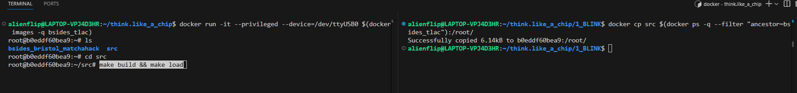

# Error

> [!IMPORTANT]
> This example is a simple traffic light design, can you spot the bug?

> [!NOTE]
> One button starts the traffic light, the other will reset the progam (RED led active). Experiment to see which button does what!

> [!TIP]
> Run the following from your terminal to build and load the design to your FPGA:

> Run the following from `wsl` to copy the source files to your container:
```
docker ps
docker cp src $(docker ps -q --filter "ancestor=bsides_tlac"):/root/
```

> Now in your container, run the following to program the FPGA:
```
cd src 
make build && make load
```

